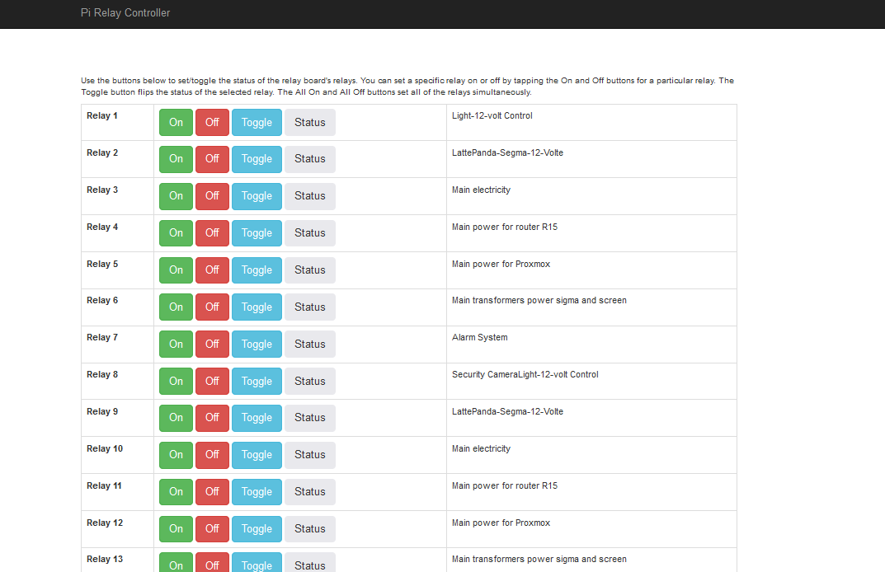

# pi5-relay-controller-16-channel
Raspberry Pi 5 Relay Controller 16-Channel
# Raspberry Pi Relay Controller

This project combines a simple 16-channel relay switch with a raspberry pi model 5 to make a network connected relay switch at a significant savings over commercial offerings.  

This project provides a library you can use in your Python applications plus a Python web application (written using [Flask](http://flask.pocoo.org/)) to interact with the board from a web browser.

## About the Board

The board looks something like the following (image from [amazon.com](https://www.amazon.com/MECCANIXITY-Relay-Module-Channel-Trigger/dp/B0B7XMGRSW)):

## Hardware Components

To use this project, you'll need at a minimum the following hardware components:

+ [Raspberry Pi](https://www.raspberrypi.org/products/raspberry-pi-2-model-b/)
+ [ModMyPi PiOT Relay Board](https://www.modmypi.com/raspberry-pi/breakout-boards/modmypi/modmypi-piot-relay-board)
+ 5V, 2.5A Micro USB power source (basically, a smartphone charger)

## Assembly

Attach the VCC and GND pins of the board to the respective pins on the GPIO header of the raspberry pi.  The remaining 8 pins control the relays, and are attached to the GPIO pins on the raspberry pi.  Consult the pinout diagram of the version of the raspberry pi you're using for the correct numbering.  I'm using a raspberry pi Model 5.  The pinout diagram of this version is here [pinout](https://pinout.xyz/)

## Configuring Your Raspberry Pi

Download the latest version of the Raspbian OS from the [Raspberry Pi web site](https://www.raspberrypi.org/downloads/raspbian/) and follow the [instructions](https://www.raspberrypi.org/documentation/installation/installing-images/README.md) for writing the OS image to a Micro SD card for the Pi. Insert the **SD card** in the Pi, connect **Ethernet**, **keyboard**, **mouse**, and a **monitor** to the Pi and finally **power it up** using a smartphone charger or some suitable power source.

Raspbian comes configured with its keyboard, timezone, and other locale settings configured for the United Kingdom (UK), so if you're in the US, or elsewhere that's not the UK, you'll want to switch over to the **localisation** tab and adjust the settings there as well.

When the Pi comes back up, open a terminal window and execute the following command:

	sudo apt-get update

This updates the local catalog of applications. Next, execute the following command:

	sudo apt-get upgrade

This command will update the Raspbian OS with all updates released after the latest image was published. The update process will take a long time, so pay attention, answer any prompts, and expect this process to take a few minutes or more (the last time I did this, it took about 15 minutes or more to complete).

## Software Installation & Configuration

The controller's Flask application uses Flask and the Flask Bootstrap plugin to serve [Bootstrap](http://getbootstrap.com/) applications, so in the terminal window, install the plugin by executing the following command:  

	sudo pip install flask flask_bootstrap

Finally, clone the controller application to your local system by executing the following commands:

	git clone https://github.com/baalwy/pi5-relay-controller-16-channel
	cd pi5-relay-controller-16-channel

Since the relay's GPIO port assignments can be easily changed using the buttons on the board, before you can run the project, you must make one change to the project's server code. Open the project's `server.py` file using your editor of choice. Near the top of the file, you should see the following lines of code:

	# Update the following list/tuple with the port numbers assigned to your relay board
	PORTS = (1, 2, 3, 4, 5, 6, 7, 8, 9, 10, 11, 12, 13, 14, 15, 16)

This ports list refers to the GPIO port configuration for the board referenced in the pinout diagram. Change the values here based on your board's configuration. I don't know what the default configuration is.

## Starting the Server Process

Open a terminal window and execute the following commands:

	cd pi5-relay-controller-16-channel
	ls

You should see the project's files listed. The project includes a script file to automate launching the server process. To use this file, you'll first have to make the file executable. In the terminal window, execute the following command:

	chmod +x start-server.sh

Once that's done, execute the script file using the following command:

	./start-server.sh

The server process will launch and update the terminal window as shown in the following figure:

If you open the web browser on the Pi and point it to `http://localhost:5000` you should see the web application load as shown in the following figure:

Click any of the buttons to interact with the relay board.  Alternatively, turn on/off or toggle a channel with a GET request to
  * Channel 3 on: http://relay-host/on/3
  * Channel 5 off: http://relay-host/off/5
  * Channel 7 toggle: http://relay-host/toggle/7

To make the server process start every time your boot the Raspberry Pi, you'll need to open the pi user's session autostart file using the following command:  

	sudo nano ~/.config/lxsession/LXDE-pi/autostart    

Add the following lines to the end (bottom) of the file:

	@lxterminal -e /home/pi/pi5-relay-controller-16-channel/start-server.sh

To save your changes, press `ctrl-o` then press the Enter key. Next, press `ctrl-x` to exit the `nano` application.

Reboot the Raspberry Pi; when it restarts, the python server process should execute in its own terminal window automatically.
